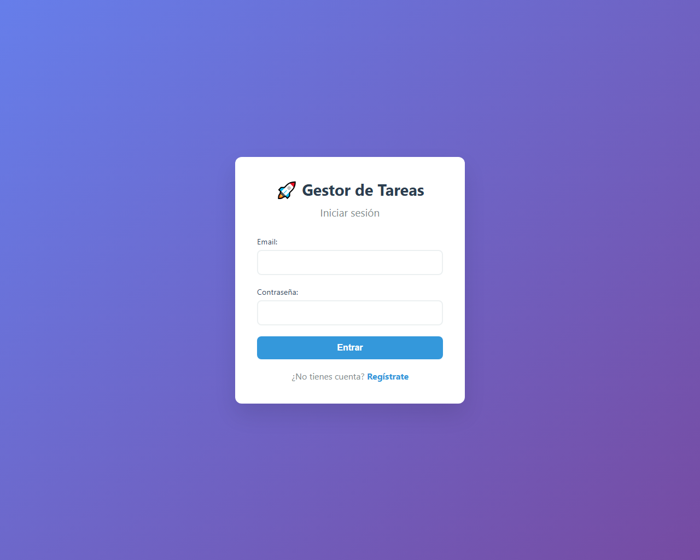
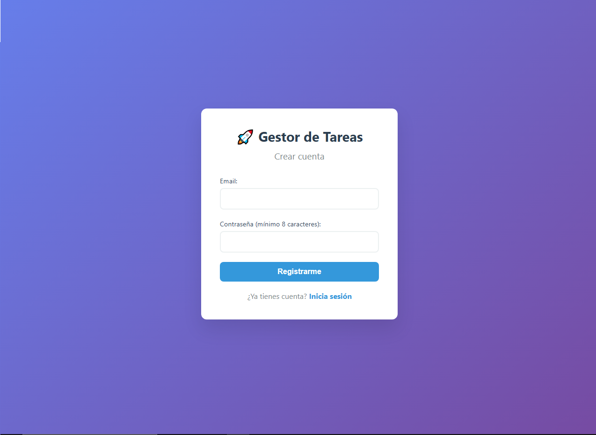
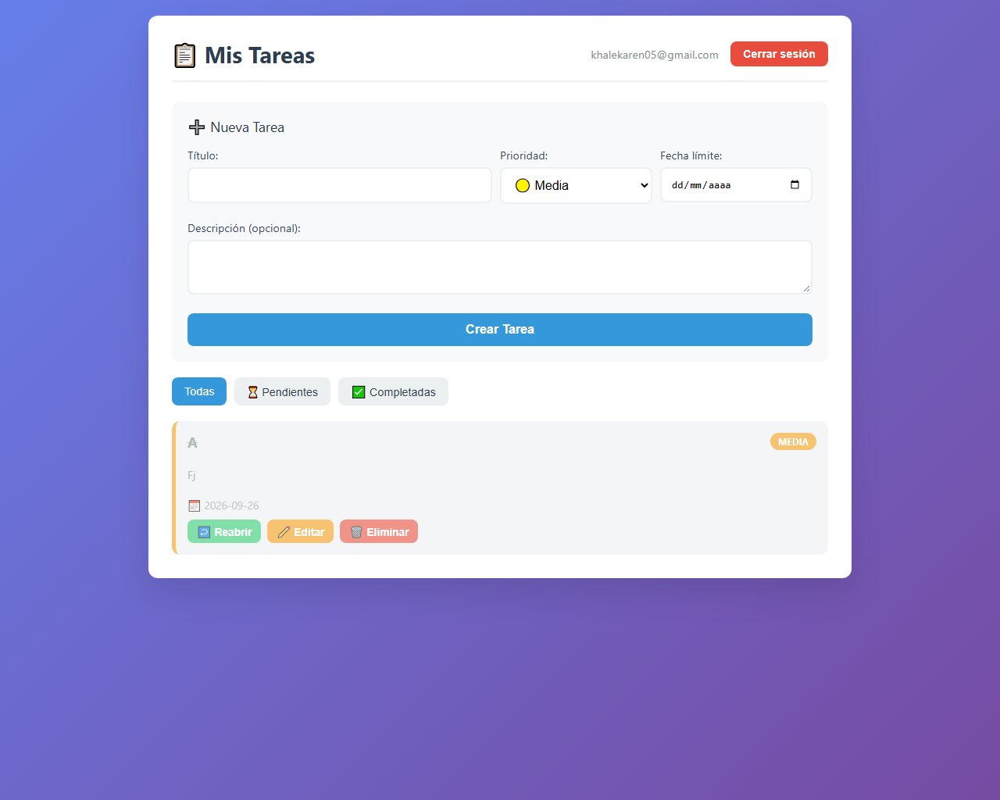
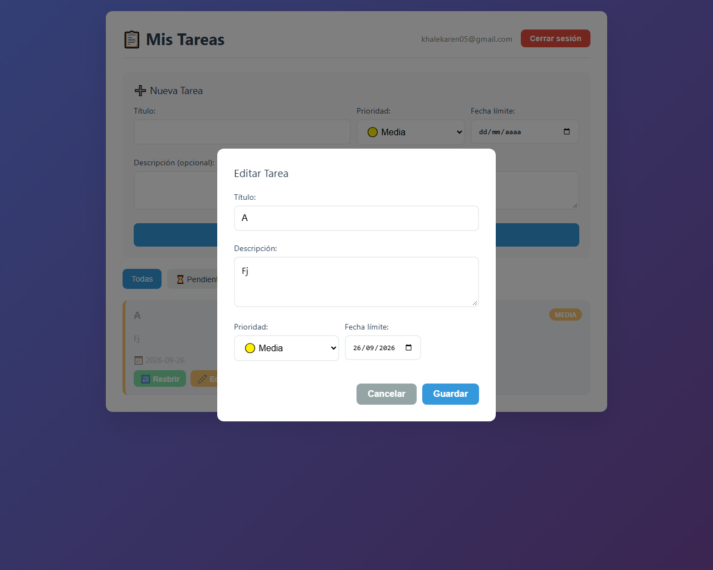

# 🚀 Gestor de Tareas - API REST con JWT

API REST con autenticación JWT + frontend vanilla. Producto interno de NovaTech.

## 📋 Stack

- Python 3.10+
- Flask
- Flask-JWT-Extended
- SQLAlchemy + SQLite (local) / PostgreSQL (producción)
- Gunicorn
- Docker + Docker Compose
- pytest + GitHub Actions
- HTML + CSS + JavaScript (vanilla)

## 🌐 URL Pública (Producción)

**API desplegada en Render:** `https://gestor-tareas-api-7efn.onrender.com`

> ⚠️ **Nota:** El servicio gratuito de Render duerme tras 15 minutos de inactividad. La primera petición tarda 30-50 segundos en responder.

**Frontend incluido:** La misma URL sirve el frontend (`/login`, `/registro`, `/dashboard`) y la API.

### Ejemplos con la URL pública

    # Health check
    curl https://gestor-tareas-api-7efn.onrender.com/health

    # Ping
    curl https://gestor-tareas-api-7efn.onrender.com/ping

    # Registro
    curl -X POST https://gestor-tareas-api-7efn.onrender.com/auth/registro \
      -H "Content-Type: application/json" \
      -d "{\"email\":\"khale@example.com\",\"password\":\"secreto123\"}"

    # Login
    curl -X POST https://gestor-tareas-api-7efn.onrender.com/auth/login \
      -H "Content-Type: application/json" \
      -d "{\"email\":\"khale@example.com\",\"password\":\"secreto123\"}"

## 📸 Screenshots

| Login | Registro |
|-------|----------|
|  |  |

| Dashboard | Editar tarea |
|-----------|--------------|
|  |  |

## 📦 Instalación local

    git clone https://github.com/Ozzol1/Gestor-Tareas-Api
    cd gestor-tareas-api
    py -m pip install -r requirements.txt

## 🔐 Configuración

Copia el archivo de ejemplo y ajusta los valores:

    copy .env.example .env

Genera una clave secreta segura para `JWT_SECRET_KEY`:

    py -c "import secrets; print(secrets.token_hex(32))"

## 🚀 Uso local (sin Docker)

    py -m flask --app app run --debug

La API corre en `http://127.0.0.1:5000`.

## 🐳 Uso con Docker

### Construir y correr con Docker Compose

    docker-compose up --build

La API corre en `http://localhost:5000`.

### Detener los contenedores

    docker-compose down

### Detener y borrar el volumen de datos

    docker-compose down -v

### Construir solo la imagen

    docker build -t gestor-tareas-api .

### Correr el contenedor manualmente

    docker run -p 5000:5000 --env-file .env gestor-tareas-api

## 📚 Endpoints

### Autenticación

| Método | Ruta | Descripción | Auth |
|--------|------|-------------|------|
| POST | `/auth/registro` | Crear usuario | ❌ |
| POST | `/auth/login` | Iniciar sesión → devuelve JWT | ❌ |
| GET | `/auth/perfil` | Datos del usuario autenticado | ✅ |

### Tareas (todas requieren JWT)

| Método | Ruta | Descripción |
|--------|------|-------------|
| GET | `/tareas` | Listar tareas propias. Filtro: `?completada=true/false` |
| GET | `/tareas/<id>` | Obtener una tarea propia |
| POST | `/tareas` | Crear tarea |
| PATCH | `/tareas/<id>` | Actualizar tarea propia |
| DELETE | `/tareas/<id>` | Eliminar tarea propia |

### Utilidades

| Método | Ruta | Descripción |
|--------|------|-------------|
| GET | `/ping` | Verificar que la API responde |
| GET | `/health` | Healthcheck para Render |

**Nota:** Un usuario **no puede ver ni modificar tareas de otro usuario**. Devuelve `404` por seguridad.

## 🔧 Ejemplos con curl (local)

### 1. Registro

    curl -X POST http://127.0.0.1:5000/auth/registro \
      -H "Content-Type: application/json" \
      -d "{\"email\":\"khale@example.com\",\"password\":\"secreto123\"}"

### 2. Login

    curl -X POST http://127.0.0.1:5000/auth/login \
      -H "Content-Type: application/json" \
      -d "{\"email\":\"khale@example.com\",\"password\":\"secreto123\"}"

Copia el `access_token` de la respuesta.

### 3. Crear tarea (con token)

    curl -X POST http://127.0.0.1:5000/tareas \
      -H "Content-Type: application/json" \
      -H "Authorization: Bearer TU_TOKEN_AQUI" \
      -d "{\"titulo\":\"Mi tarea\",\"prioridad\":\"alta\"}"

### 4. Listar mis tareas

    curl http://127.0.0.1:5000/tareas \
      -H "Authorization: Bearer TU_TOKEN_AQUI"

## 🧪 Tests

    py -m pytest tests/ -v

También se ejecutan automáticamente en cada push a `main` vía **GitHub Actions**.

## 📥 Migración de datos

Si tienes un `tareas.json` del proyecto anterior:

    py migrar_json.py ruta/al/tareas.json

## 🧱 Modelo de datos

- **Usuario**: cada usuario tiene email único y contraseña hasheada con werkzeug.
- **Tarea**: cada tarea **pertenece obligatoriamente a un usuario** (`usuario_id` es `NOT NULL`). No existen tareas huérfanas en el modelo final.

## ☁️ Deploy

La API está desplegada en **Render** con:

- **Runtime**: Docker
- **Base de datos**: PostgreSQL 18 (free tier, expira cada 30 días)
- **Región**: Ohio (US East)
- **Variables de entorno**: `JWT_SECRET_KEY`, `DATABASE_URL`, `FLASK_ENV`, `JWT_ACCESS_TOKEN_EXPIRES`
- **Servidor**: Gunicorn con 1 worker (para evitar race conditions al crear tablas)
- **CI/CD**: GitHub Actions ejecuta los tests en cada push

### Arquitectura del Dockerfile

- **Stage 1 (builder)**: instala las dependencias con pip.
- **Stage 2 (runtime)**: imagen final ligera, usuario no-root (`appuser`), solo lo necesario.
- **Entrypoint**: crea las tablas antes de arrancar gunicorn.

## 🧠 Decisiones técnicas

### ¿Por qué JWT en lugar de sesiones con cookies?
JWT permite que la API sea **stateless**. Cada petición lleva el token y el servidor no necesita recordar quién está logueado. Esto facilita el escalado horizontal y es el estándar en APIs REST modernas.

**Trade-off consciente:** El token se guarda en `localStorage`, lo cual es vulnerable a XSS. En una app bancaria usaría cookies `httpOnly`. Para un portafolio, `localStorage` es aceptable y permite que funcione desde cualquier dispositivo sin configuración extra de CORS.

### ¿Por qué SQLite local y PostgreSQL en producción?
- **SQLite (local):** cero configuración, un solo archivo, ideal para desarrollo rápido y tests.
- **PostgreSQL (producción):** soporta concurrencia, transacciones robustas y es el estándar de la industria.

El código detecta el motor automáticamente según el `DATABASE_URL`.

### ¿Por qué Docker multi-stage?
Reduce el tamaño de la imagen final separando el stage de construcción (con compiladores) del de ejecución (solo runtime). Usa un usuario no-root para reducir la superficie de ataque.

### ¿Por qué Render?
Free tier generoso, deploy automático al hacer push, soporte nativo para Docker y PostgreSQL. Ideal para portafolios.

## 🗺️ Roadmap futuro

- Refresh tokens (JWT con expiración más larga).
- Roles (admin / user) para compartir tareas.
- WebSockets para actualizaciones en tiempo real.
- Notificaciones push cuando vence una tarea.
- Tests de frontend con Playwright.
- Migrar a Supabase cuando expire la DB de Render (90 días).

## 📁 Estructura

    gestor-tareas-api/
    ├── .github/workflows/   # CI con GitHub Actions
    │   └── tests.yml
    ├── app/
    │   ├── __init__.py      # Factory + JWT + logging
    │   ├── models.py        # Usuario + Tarea
    │   ├── routes.py        # Endpoints de tareas
    │   ├── auth.py          # Endpoints de autenticación
    │   ├── validators.py    # Validaciones
    │   ├── utils.py         # Helpers (email, password)
    │   ├── static/          # CSS + JavaScript
    │   │   ├── css/style.css
    │   │   └── js/
    │   │       ├── api.js
    │   │       ├── auth.js
    │   │       └── tareas.js
    │   └── templates/       # HTML del frontend
    │       ├── login.html
    │       ├── registro.html
    │       └── dashboard.html
    ├── docs/screenshots/    # Capturas del proyecto
    ├── tests/
    │   └── test_tareas.py
    ├── conftest.py
    ├── migrar_json.py
    ├── entrypoint.sh        # Script de arranque para Docker
    ├── Dockerfile
    ├── docker-compose.yml
    ├── .dockerignore
    ├── requirements.txt
    ├── .env.example
    ├── README.md
    └── .gitignore

## 👤 Autor

**Khale Rodríguez** — Desarrollador Junior, NovaTech.